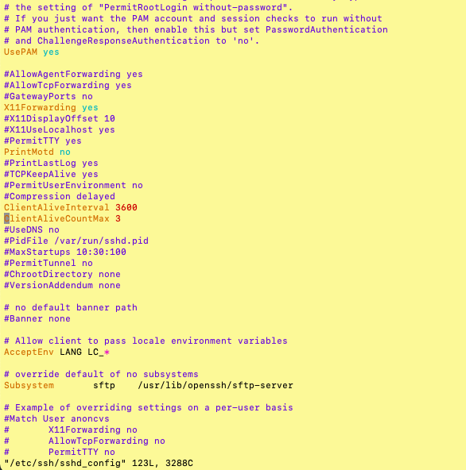

### Increase SSH Connection Timeout

On the server, head over to the `/etc/ssh/sshd_config` configuration file.

		$ sudo vi /etc/ssh/sshd_config

Scroll and locate the following parameters:

		#ClientAliveInterval
		#ClientAliveCountMax

The `ClientAliveInterval` parameter specifies the time in seconds that the server will wait before sending a null packet to the client system to keep the connection alive.

On the other hand, the `ClientAliveCountMax` parameter defines the number of client alive messages which are sent without getting any messages from the client. If this limit is reached while the messages are being sent, the sshd daemon will drop the session, effectively terminating the ssh session.

The timeout value is given by the product of the above parameters i.e.

		Timeout value = ClientAliveInterval * ClientAliveCountMax

For example, let’s say you have defined your parameters as shown:

		ClientAliveInterval  1200
		ClientAliveCountMax 3

The Timeout value will be `1200 seconds * 3 = 3600 seconds`. This is an equivalent of 1 hour, which implies that your ssh session will remain alive for idle time of `1 hour` without dropping.

Alternatively, you can achieve the same result by specifying the ClientAliveInterval parameter alone.

		ClientAliveInterval  3600

Once done, reload the OpenSSH daemon for the changes to come into effect.

		$ sudo systemctl reload sshd
